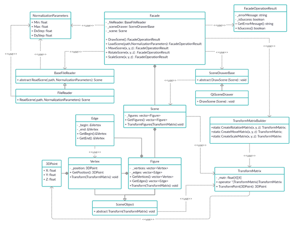
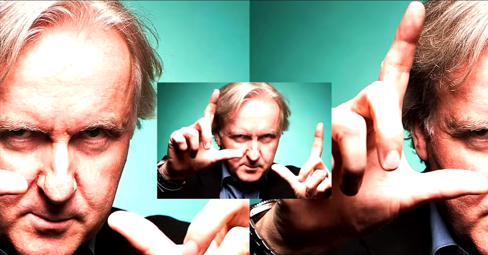

# Viewer3D (C++)
⚠️ Description of the project was originally written in Russian language.

This project is an application for viewing 3D models in wireframe mode. It is implemented in C++ using the object-oriented programming paradigm.

## Theory

### Design patterns
[Design patterns](/materials/patterns_info.md) - recurring problems in software design, along with general principles and solutions for addressing them.

### Example Class Diagram
⚠️ This diagram does not fully reflect the project’s structure.

## Checklist
### Main Part
|Check|Requirement|
|---|---|
|✔|A program for visualizing 3D wireframe models has been developed.|
|✔|Implemented in C++20.|
|✔|Source code is located in the src directory.|
|✔|Code follows Google C++ Style Guide (ColumnLimit: 120).|
|✔|Build system configured with CMake/Makefile, including standard GNU targets:      - all,      - install,      - uninstall,      - clean,      - dvi,      - dist,      - tests,      - coverage.|
|✔|Implementation follows OOP principles (structural/functional approach is not allowed).|
|✔|Full unit test coverage provided for modules related to model loading and affine transformations.|
|✔|Only one model may be displayed on screen at any time.|
|✔|Features include:     - Load wireframe models from .obj files (support for vertex and face lists only).     - Translate the model along the X, Y, Z axes.     - Rotate the model around the X, Y, Z axes.     - Scale the model by a given factor.|
|✔|Graphical User Interface (GUI) implemented using any C++-compatible library:     * Linux: GTK+, CEF, Qt, JUCE     * macOS: GTK+, CEF, Qt, JUCE, SFML, Nanogui, Nngui|
|✔|GUI must include:     - A file selection button with a display field for the chosen file name.     - A rendering area for the wireframe model.     - Buttons/inputs for translation, rotation, and scaling.     - Display of model information: file name, number of vertices, number of edges.|
|✔|The program must handle models with up to 1,000,000 vertices without UI freezes (>0.5s unresponsiveness).|
|✔|Must follow the MVC design pattern:     - No business logic in the View.     - No GUI code in the Controller or Model.     - Controllers must remain lightweight.|
|✔|At least three different design patterns must be used (example: Facade, Strategy, Command).|
|✔|Affine transformations rely on the matrix library from [matrices_CPP_pet](https://github.com/Georgiy-JO/matrices_CPP_pet)|
|✔|Repository must not contain large files (>10 MB).|

### Second Part
|Check|Requirement|
|---|---|
|+/-	|Settings functionality partially implemented.|
|✔	|Projection modes supported: parallel and perspective.|
|+/-	|Customization options: line style (solid, dashed), edge color, edge thickness (not supported on some systems), vertex rendering (none, circle, square), vertex color, vertex size.|
|✔	|Background color selection supported.|
|✔	|User settings persist across program restarts.|

⚠️ Due to OpenGL version conflicts (2.0+ vs 3.0+), line thickness customization was not implemented in this version. It may be added in the future if a better solution is found than rendering edges as rectangles.

### Third Part
|Check|Requirement|
|---|---|
|✔|Recording functionality implemented.|
|✔|Images can be saved in BMP and JPEG formats.|
|✔|The application can record short screencasts of affine transformations as GIF animations (640×480, 10 FPS, 5 seconds).|

📌 GIF recording uses a header-only library by Charlie Tangora.

## Project Notes

[**Constants list**](/src/README_constants.md)

## Meme
